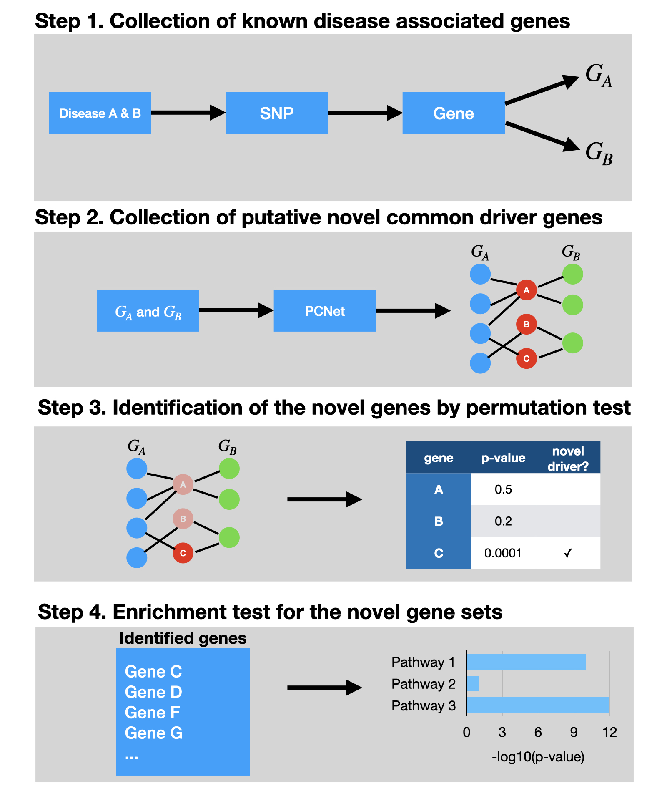

# NICD

**N**etwork-based *I*dentification of **C**ommon **D**river genes (NICD) is a python package that utilizes 
PCNet and DisGeNET to identify putative driver genes of multiple diseases. 

## Workflow of NICD



## Installation

```
git clone https://github.com/hyunhwaj/NICD/
cd NICD
pip install .
```

## How to use 

1. `NICD_DB_download` has to be run to download database files.

```
$ NICD_DB_download
```

2. The following command-line is an example to run NICD.

```
NICD -a C0524851,C0002736,C0030567,C0002395,C0020179,C0497327,C0338656,C0011265,C0038454,C0242422,C0233794,C0026769,C0338451,C0752347 -b C0520679,C0037315,C0520680 -r 123 --name_a Dementia --name_b OSA
```

## NICD command-line options

```
usage: NICD [-h] -a DISEASE_A -b DISEASE_B [-n NITER] [-c CUTOFF] [-v VERBOSE]
            [-o OUTPATH] [-r RANDOM_SEED] [--name_a NAME_A] [--name_b NAME_B]

optional arguments:
  -h, --help            show this help message and exit
  -a DISEASE_A, --disease_a DISEASE_A
                        A list of DisGeNet disease IDs.
  -b DISEASE_B, --disease_b DISEASE_B
                        Another list of DisGeNet disease IDs.
  -n NITER, --niter NITER
                        A parameter for the permutation test, |initial common
                        genes| * niter iterations will be performed for the
                        permutation test.
  -c CUTOFF, --cutoff CUTOFF
                        The FDR cutoff for the final output.
  -v VERBOSE, --verbose VERBOSE
                        Increase output verbosity.
  -o OUTPATH, --outpath OUTPATH
                        The directory path of the output.
  -r RANDOM_SEED, --random_seed RANDOM_SEED
                        A random seed for random number generations.
  --name_a NAME_A       The name of the first list.
  --name_b NAME_B       The name of the second list.
  ```
  

